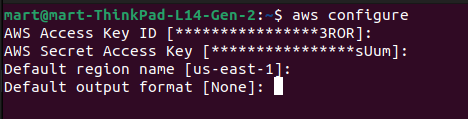
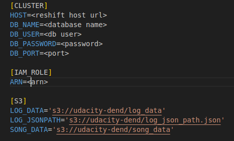

# Data Warehouse for a music streaming app 

## Overview

This project entails building an ETL pipeline that extracts their data from S3, stages them in Redshift, and transforms data into a set of dimensional tables for their analytics team to continue finding insights into what songs their users are listening to.

# Setting up AWS resources
### Set AWS access key and secret 
```
aws configure
``` 


To access AWS, you need to do in AWS the following:

- Create IAM user
- Create IAM role with AmazonS3ReadOnlyAccess policy attached
- Get ARN of the role
- Create and run Redshift cluster   

### Add credentials to dwh.cfg  


## Structure

The project contains the following components:

* `create_tables.py` creates the our star schema in Redshift cluster
* `etl.py` defines the ETL pipeline, extracting data from S3, loading into staging tables on Redshift, and then processing into analytics tables on Redshift
* `sql_queries.py` defines the SQL queries that create the star schema and ETL pipeline

*  `dwh.cfg` store sensitive information like database credentials, IAM ARN, AWS access, and secret keys

## Database Schema

The database contains:
Fact table:

* `songplays` - user songplays and contains foreign keys of related dimension tables.  

Dimension tables:
* `users`
* `artists`
* `songs`
* `time`

## Sparkify star schema design


## Instructions
1. CD into the working directory
2. Create tables
```
python3 create_tables.py
```
3. Load data from S3 into staging tables on Redshift and then process that data into your analytics tables on Redshift.
```
python3 etl.py
```

References

- Data Engineering with AWS - https://learn.udacity.com/nanodegrees/nd027

- Amazon Redshift -https://docs.aws.amazon.com/redshift

- COPY from S3 bucket format— https://docs.aws.amazon.com/redshift/latest/dg/copy-parameters-data-source-s3.htm
